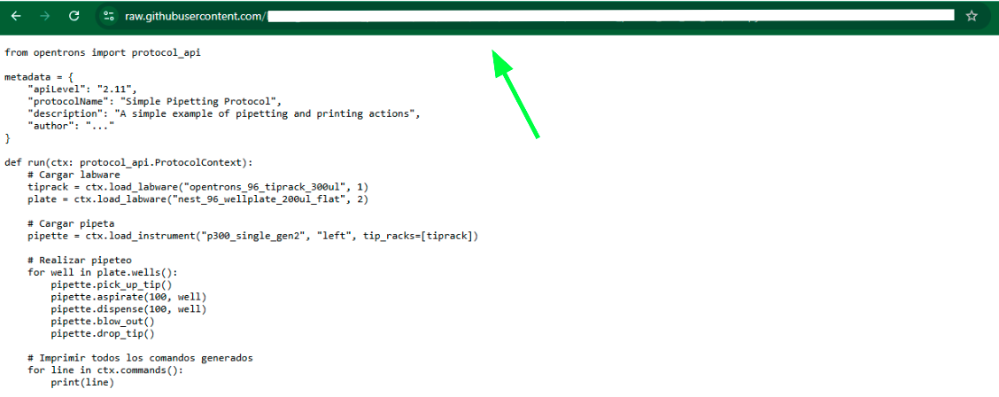
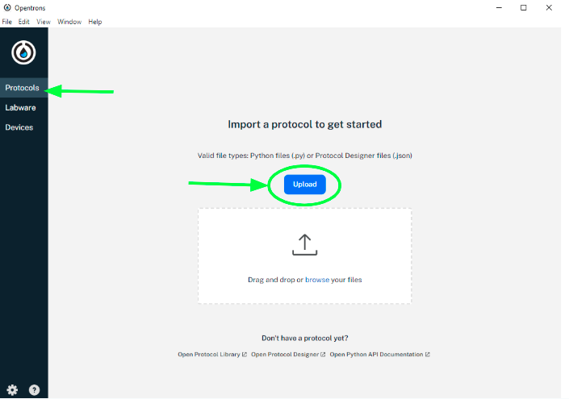
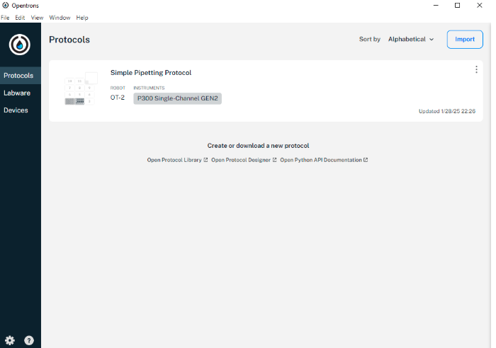

# Protocols for Opentrons OT-2
By The Trypanosomatics Laboratory, UNSAM

This repository contains scripts (.py) for protocols described in our paper, designed for use with the Opentrons OT-2 automated pipetting robot. These protocols cover:
- Preparation of drug dilutions and combinations
- Cell lysis procedure
- Solution transfer to 384-well plates and substrate addition
Additionally, a specification file (.txt) details required labware and procedural steps for each protocol.

# How to use this protocols  
First of all, it is important to clarify that the following steps were carried out using **Ubuntu**, a terminal that is already included in **Linux**. If using **Windows**, the terminal can be downloaded as indicated in the first three steps of the official Opentrons site at the following link: (https://support.opentrons.com/s/article/Write-and-simulate-protocols-on-Windows-10). It is recommended to use this setup to correctly follow these instructions and avoid any issues.  

## Step-by-Step Guide  
1. **Access the Protocols Folder**  
   Once inside the **GitHub repository**, navigate to the **"PROTOCOLS"** folder. Inside, there will be a file named **"Specifications.txt"** (previously mentioned) along with three additional files, which are the protocols. Open one of these three protocol files.  

2. **Copy the Raw File URL**  
   Once the desired file is open, click on the **"Raw"** button (Figure 1) and copy the URL of the page that opens, as shown in Figure 2.  
   
   
   Example of a copied URL:  
https://raw.githubusercontent.com/user/repository/branch/file.py

3. **Download the File to the Local System**  
The next step is to download the selected file to the local system.  
- Open the **Linux terminal** in the folder where the protocol should be downloaded.  
  - One way to do this is by manually opening the folder, right-clicking inside it, and selecting **"Open in Terminal."**  
  - Another way, if the terminal is already open, is to navigate to the desired folder using the command:  
    ```sh
    cd folder_name
    ```
- Once in the correct folder, type the following command in the terminal, replacing the URL with the copied one from step 2:  
  ```sh
  wget https://raw.githubusercontent.com/user/repository/branch/file.py
  ```
- After running this command, the file should be downloaded from **GitHub**. To verify the download, use:  
  ```sh
  ls -l
  ```

4. **Import the Protocol into the Opentrons Application**  
- Open the **Opentrons** application and go to the **"Protocols"** section. Click on the **"Upload"** option.  
- Select the downloaded file and click **"Open."**  

- If other protocols have already been added, go to the **"Import"** section, where the **"Upload"** option will be available.  


> **Note:** It is essential to ensure that the downloaded file is in **`.py`** format. Otherwise, it will not be recognized by the application.


Due to the fact that the protocols were designed to be as "flexible" and adaptable as possible to our specific needs, they do not include fixed labware positions or amounts. This approach allows users to instantly define, for example, the number of plates they want to work with at a given time or, in the case of 384-well plates used for measurements, specify the starting column to optimize the use of the plate's capacity. Consequently, these protocols do not include the standard def run() function typically used to define labware positions, which is also required for recognition by the traditional Opentrons application.
To use these protocols, researcher must follow these steps:
1. Copy the protocol of interest from the repository: "LINKKKKKKKK".
2. Open the Opentrons OT-2 application.
3. Navigate to: Robot Settings > Advanced > Jupyter Notebook.
3. Once the notebook is open, create there a folder and paste the copied protocol into it.
4. By clicking the "RUN" button at the top of the notebook window, users can execute the desired protocol and define labware positions as needed.
Finally, we strongly recommend thoroughly reading the accompanying .txt file before executing any of the protocols provided in this repository.