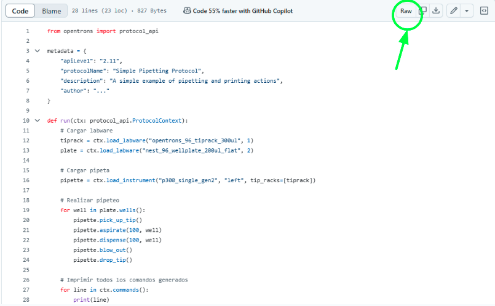

# Protocols for Opentrons OT-2
By The Trypanosomatics Laboratory, UNSAM

This repository contains scripts (.py) for protocols described in our paper, designed for use with the Opentrons OT-2 automated pipetting robot. These protocols cover:
- Preparation of drug dilutions and combinations
- Cell lysis procedure
- Solution transfer to 384-well plates and substrate addition
Additionally, a specification file (.txt) details required labware and procedural steps for each protocol.

# How to use this protocol

Due to the fact that the protocols were designed to be as "flexible" and adaptable as possible to our specific needs, they do not include fixed labware positions or amounts. This approach allows users to instantly define, for example, the number of plates they want to work with at a given time or, in the case of 384-well plates used for measurements, specify the starting column to optimize the use of the plate's capacity. Consequently, these protocols do not include the standard def run() function typically used to define labware positions, which is also required for recognition by the traditional Opentrons application.
To use these protocols, researcher must follow these steps:
1. Copy the protocol of interest from the repository: "LINKKKKKKKK".
2. Open the Opentrons OT-2 application.
3. Navigate to: Robot Settings > Advanced > Jupyter Notebook.
3. Once the notebook is open, create there a folder and paste the copied protocol into it.
4. By clicking the "RUN" button at the top of the notebook window, users can execute the desired protocol and define labware positions as needed.
Finally, we strongly recommend thoroughly reading the accompanying .txt file before executing any of the protocols provided in this repository.